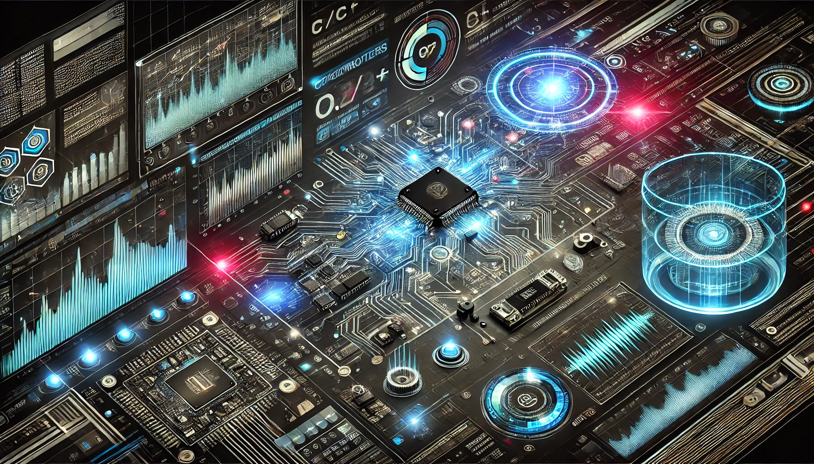

# 👋 Hello, I'm Kunal Salvi

## 🚀 About Me
I am a passionate embedded system engineer with over 4 years of hands-on experience in designing and developing innovative solutions for the embedded world. My journey in the field has equipped me with a deep understanding of hardware-software integration, real-time systems, and low-level programming.

## 🛠️ Skills
- **Programming Languages:** C, C++, Python, HTML, CSS, Rust, Embedded C/C++, Java, System Verilog, VHDL, MATLAB
- **Microcontrollers:** STMicroelectronics, NXP, TI, Microchip, Atmel
- **Communication Protocols:** I2C, SPI, UART/USART, CAN, Ethernet, I2S, TCP/IP, USB, SAI, SDIO, SWD, JTAG, BacNET
- **Peripherals:** DCMI, DMA, Clock, Timer, Real Time Clock, GPIO, Interrupts, ADC, DAC, Watchdog, FSMC, DC/D
- **RTOS:** FreeRTOS, ChibiOS, CMSIS RTOS
- **Embedded Software Development:** Bare-metal programming, Firmware development, Real-Time System development
 

## 🌐 Connect with Me
- [LinkedIn](https://www.linkedin.com/in/kunalsalvi63)

## 📚 Education
- **Bachelor of Engineering in Electronics** from University of Mumbai (2019)
- **Masters of Science in Electrical Engineering** from University of Texas at Arlington (2024)

## 🌱 Interests
Embedded systems, IoT, Robotics, Low-level programming, and Continuous learning.

 

 

